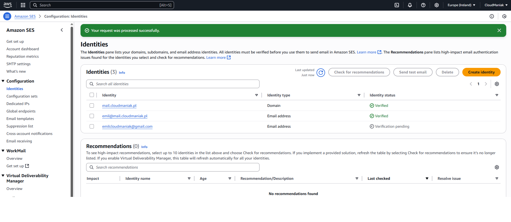
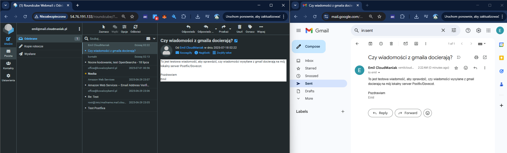
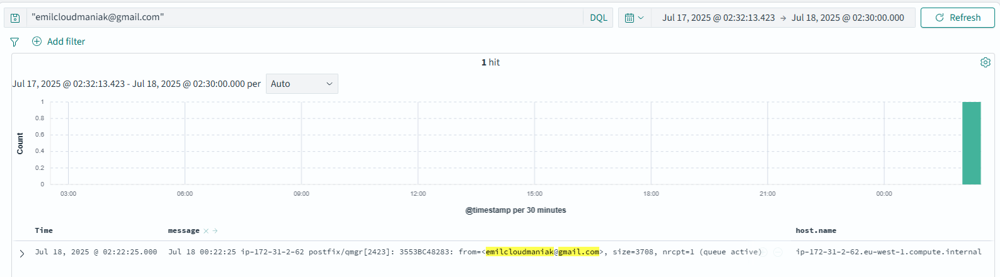
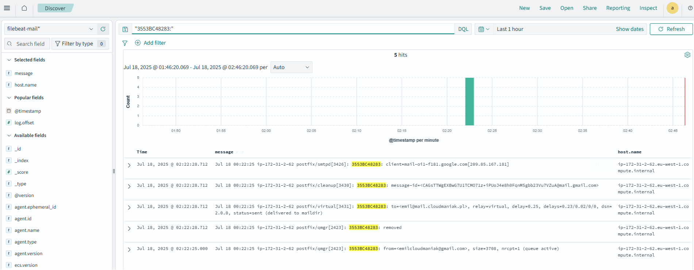
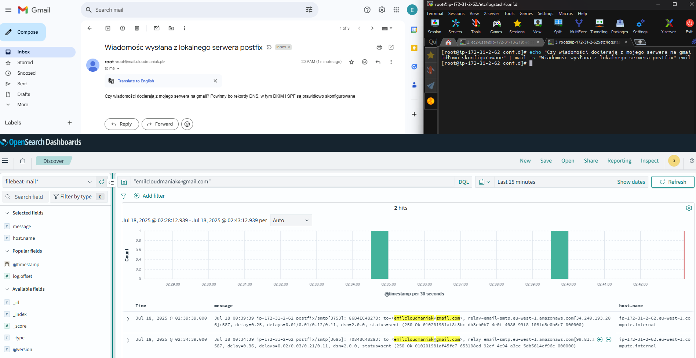

# 📬 Demo: Mail Server + OpenSearch Log Monitoring (PoC)

Ten dokument przedstawia demo działania serwera pocztowego skonfigurowanego z wykorzystaniem **Postfix, Dovecot, Filebeat, Logstash i OpenSearch**, wraz z wysyłką maili przez **Amazon SES**.

---

## ☁️ Wysyłka wychodząca przez SMTP RELAY (Amazon SES – sandbox)

### 1. Dodanie nadawcy w Amazon SES

W związku z działaniem w trybie *sandbox*, najpierw należy dodać zatwierdzony adres email jako "Identity":

---

## 📥 Odbieranie wiadomości przez serwer (Dovecot)

### 2. Wysyłka testowa z Gmail na mój serwer

Wiadomość została wysłana z adresu `emilcloudmaniak@gmail.com` na mój serwer Roundcube (na adres `emil@mail.cloudmaniak.pl`):

---

## 🔎 Sprawdzenie logów przychodzących wiadomości w OpenSearch

### 3. Podgląd logu po ID wiadomości

Z dashboardu OpenSearch wybieram log i sprawdzam szczegóły po jego ID:

Szczegóły:

- Nadawca: `emilcloudmaniak@gmail.com`
- Odbiorca: `emil@mail.cloudmaniak.pl`
- Status: `saved mail to maildir` – wiadomość dostarczona

---

## 📤 Wysyłka wychodząca na Gmail (relay: SES)

### 4. Wysłanie wiadomości z Roundcube na Gmail – udana operacja

Wiadomość została prawidłowo dostarczona z serwera przez Amazon SES:

---

## ✅ Podsumowanie

- System działa w trybie dualnym: odbieranie i wysyłanie wiadomości
- Wszystkie logi są analizowane i przesyłane do OpenSearch
- Wysyłka działa przez SMTP Relay na Amazon SES
